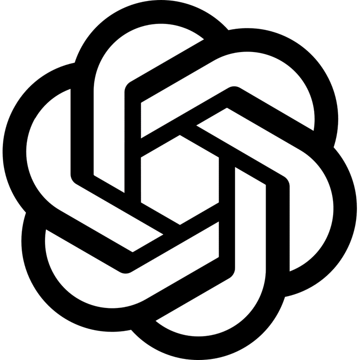
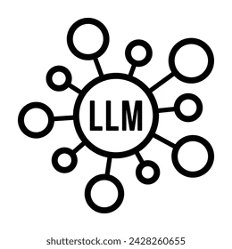

<h1 align="center">
  
</h1>

<h5 align="center">
  <code><a href="https://in.linkedin.com/in/mohit-bokade-832a92138" title="LinkedIn Profile"> LinkedIn</a></code>
  <code><a href="https://www.hackerrank.com/profile/mohitbokade87" title="HackerRank"> HackerRank</a></code>
  <code><a href="https://www.instagram.com/mohit_bokade/" title="Instagram Profile"> Instagram</a></code>
</h5>
 

  Hi, I'm Mohit Bokade, Data Analyst at MasterSoft ERP Solution
   
   
  💼 I work as a Data Analyst at MasterSoft ERP Solution, specializing in creating Power BI reports for students and universities, as well as developing and deploying machine learning models using Flask.
   
  📊 My expertise includes data analysis, building machine learning models, model selection, accuracy testing, and integrating models with Flask web APIs.
   
  💻 I have hands-on experience with various ML algorithms like Gradient Boosting, Random Forest, SVM, and XGBoost. Additionally, I have built predictive models for student entrance exam results and student attendance.
   
  📈 I am passionate about leveraging data-driven insights to improve educational processes and optimize decision-making.
   
  💬 Ask me anything from <a href="https://github.com/MohitBokade/MohitBokade/issues" title="Issues">Here</a>
   
  📫 How to reach me: <a href="mailto: mohitbokade87@gmail.com">mohitbokade87@gmail.com</a>

<h2 align="center">🔥 Languages & Frameworks & Tools & Abilities 🔥</h2>
 

  <code></code>
  <code></code>
  <code></code>
  <code></code>
  <code></code>
  <code></code>
  <code></code>
  <code></code>
  <code></code>
  <code></code>
  <code></code>
  <code></code>
  <code></code>
  <code></code>
  <code></code>
  <code></code>
  <code></code>
  <code></code>
  <code></code>
  <code></code>
  <code></code>
  <code></code>
  <code></code>

<h2 align="center">⚡ Stats ⚡</h2>
 

  

    
    </a>
    
    </a>
  

           
  

    
    </a>
  

   

  

<h2 align="center">👨‍💻 Repositories 👨‍💻</h2>
 

  

         

  

         

  

         

<h4 align="center">
  <a href="https://github.com/Mohitbkd?tab=repositories" title="Show Repositories">🔎 Show More 🔍</a>
</h4>
